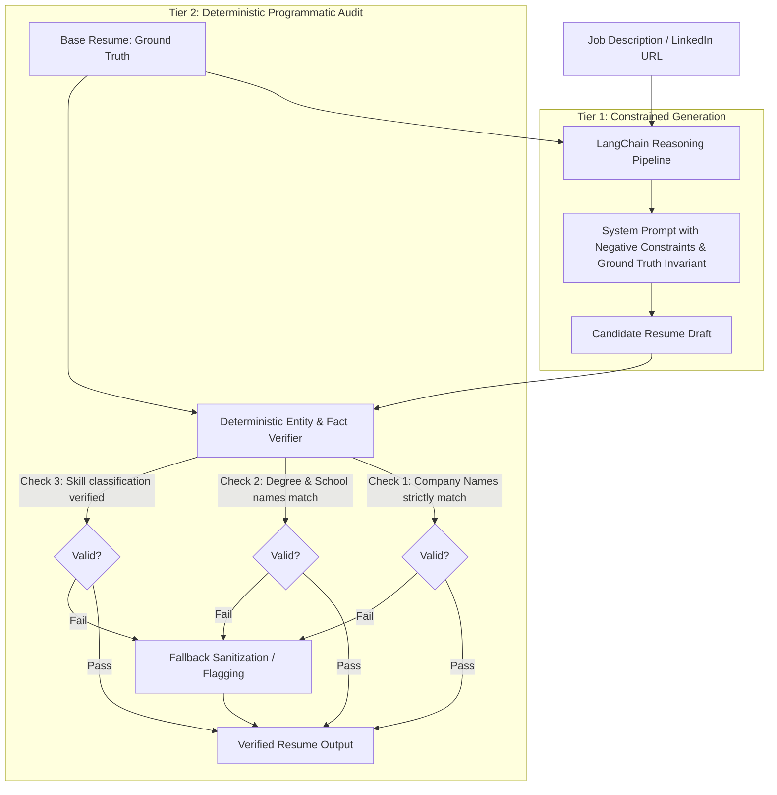

# Architecture Decision Records (ADRs)

This document records the foundational architectural decisions made for the **AI-Powered Resume Generator** platform, detailing the context, decision, consequences, and trade-offs of each choice.

---

## ADR-001: Decoupling Personal Resume Data from Core Engine Package

### Status
Accepted

### Context
Resume generation software is inherently personal, yet the core generation engine, HTML/CSS templates, prompt pipelines, and UI constitute a generic, reusable product. If personal data (names, contact information, career history) is tightly coupled with the code, the repository cannot be safely distributed, published as open source, or packaged for generic enterprise use without leaking personal identifiable information (PII).

### Decision
1. Separate code and personal data completely.
2. The core repository ships with an anonymized, generic `sample_resume.json` satisfying the schema.
3. The platform supports dynamic runtime configuration of the candidate's Base Resume via:
   - Configurable file path (`RESUME_DATA_PATH` environment variable).
   - In-app interactive UI editor where any user can import, inspect, edit, and locally persist their own base resume.
4. Add strict `.gitignore` rules covering personal resume data files (`data/*.personal.json`, `data/my_resume.json`, `.env`).

### Consequences
- **Positive**: The codebase can be safely distributed as an open-source package, containerized via Docker, or shared publicly.
- **Positive**: Zero risk of personal PII leakage into version control.
- **Negative**: Requires runtime validation to guarantee that a valid Base Resume schema exists before generation commences.

---

## ADR-002: Server-Sent Events (SSE) over WebSockets for Thought Streaming

### Status
Accepted

### Context
The user requirement mandates streaming the AI's internal decision-making process, thoughts, and progress in real time rather than waiting for a delayed batch response. We evaluated two primary transport mechanisms: WebSockets and Server-Sent Events (SSE).

### Decision
Adopt **Server-Sent Events (SSE)** via HTTP POST with `text/event-stream; charset=utf-8`.

### Rationale & Trade-off Analysis
| Criterion | WebSockets | Server-Sent Events (SSE) | Decision Alignment |
|---|---|---|---|
| Communication Direction | Full-duplex bidirectional | Unidirectional server-to-client | Generation is a unidirectional response stream |
| Transport Protocol | WebSocket framing over TCP | Standard HTTP/1.1 or HTTP/2 | Better compatibility with reverse proxies, CDNs, and load balancers |
| Connection Lifecycle | Persistent stateful connection | Standard HTTP request with streaming response | Matches RESTful semantics (`POST /api/generate/stream`) |
| Client Complexity | Requires heartbeat/ping-pong handling | Native browser `EventSource` / `fetch` `ReadableStream` | Zero external dependencies on frontend |
| Firewall/Proxy Traversal | Often throttled or blocked by corporate proxies | Operates over standard HTTP/HTTPS ports | High enterprise reliability |

### Consequences
- **Positive**: Lightweight, stateless server implementation with standard HTTP infrastructure compatibility.
- **Positive**: Directly consumable via standard browser `fetch` and `ReadableStreamDefaultReader`.

---

## ADR-003: Angular Signals for Fine-Grained Reactive State Management

### Status
Accepted

### Context
Streaming AI responses emits frequent, high-velocity events (thought tokens, phase transitions, partial resume sections). Traditional Angular change detection (Zone.js checking the entire component tree on each microtask) causes excessive re-renders and UI jank during high-frequency streaming.

### Decision
Adopt **Angular Signals** (`signal()`, `computed()`, `effect()`) for state management throughout the frontend.

### Rationale
- Signals introduce fine-grained reactivity directly to the DOM nodes that depend on them.
- High-frequency thought token updates only re-render the terminal stream view without touching the resume preview, job input form, or global navigation.
- Eliminates heavy external state management libraries (such as NgRx or Akita) for a lightweight, modular architecture.

### Consequences
- **Positive**: Superior runtime performance during 60fps streaming updates.
- **Positive**: Clean, readable reactive code with minimal boilerplate.

---

## ADR-004: Multi-Tiered Anti-Hallucination Guardrails

### Status
Accepted

### Context
Large Language Models have a known propensity to invent facts ("hallucination"). In resume generation, fabricating experience, inventing non-existent employers, inflating degrees, or asserting unverified technical proficiencies destroys candidate credibility and violates ethical standards. The platform must guarantee that the candidate's Base Resume is the inviolable Ground Truth.

### Decision
Implement a **two-tier defense in depth** against hallucinations:

1. **Tier 1 (Prompt Engineering Invariant)**: The LLM is instructed that its sole task is *re-framing*, *re-ordering*, and *highlighting* existing achievements from the base resume using the terminology of the target job description. Explicit negative constraints forbid creating new employment blocks or claiming unverified skills.
2. **Tier 2 (Deterministic Programmatic Verification)**: Before returning the resume, a deterministic Python audit function verifies that:
   - All company names in the output exist in the base resume.
   - All educational institutions and degrees exist in the base resume.
   - Experience date ranges have not been altered.
   - Generates an `AlignmentReport` summarizing direct matches, transferable skills, and explicit verification logs.

### Consequences
- **Positive**: Absolute protection against rogue LLM hallucinations.
- **Positive**: Full auditability: users can inspect exactly how the AI mapped their experience to the job requirements.

---

## ADR-005: Multi-Provider LLM Abstraction with Zero-Config Fallback

### Status
Accepted

### Context
End users have varying deployment constraints:
- Local privacy enthusiasts require **Local Ollama** (Llama 3, Mistral, Qwen) with zero external data transmission.
- Cloud users prefer state-of-the-art **OpenAI** (GPT-4o, GPT-4o-mini).
- Open-source practitioners utilize **Hugging Face Inference**.
- First-time evaluators downloading the package may not have API keys or an Ollama instance active immediately.

### Decision
Design a unified LLM Provider Adapter interface:
1. `ChatOllama` adapter.
2. `ChatOpenAI` adapter.
3. `HuggingFaceEndpoint` adapter.
4. **Intelligent Heuristic Fallback Engine**: If no external provider is configured or reachable, an intelligent heuristic keyword-mapping engine executes the exact same multi-stage alignment flow and streaming protocol deterministically. This guarantees the package works out-of-the-box on the very first run without configuration friction.

### Consequences
- **Positive**: Maximum portability across local, private, and cloud environments.
- **Positive**: 100% out-of-the-box functional experience for anyone downloading the package.

---

## ADR-006: Real-Time LLM Token Streaming (`astream`) and Domain Competency Inference

### Status
Accepted

### Context
During testing with concise job specifications (e.g. `Senior Frontend Developer at Rentman — Utrecht, Netherlands`) and local Ollama execution, two architectural friction points emerged:
1. **LLM Invocation Latency Freeze**: Calling synchronous/blocking `ainvoke()` caused a ~60–80 second delay where no SSE chunks were yielded, giving the illusion of a frozen or broken system.
2. **Concise Headline Inputs**: Users frequently paste high-level role headlines rather than multi-page technical checklists. Rigid literal keyword matching produced empty competency matches for concise titles.
3. **Capacity Misunderstanding**: Dynamic character length counters (e.g. `Ingesting job specification (172 characters)...`) were misinterpreted by users as arbitrary character limits.

### Decision
1. **Granular Token Streaming**: Replaced blocking `ainvoke()` with LangChain's asynchronous token streaming `llm.astream()`. The engine yields granular `thought_stream` / `token` events over SSE as words are emitted, rendering a live typewriter view in the frontend.
2. **Entity & Domain Competency Inference**: Enhanced the analysis stage to extract entities (company: *Rentman*, location: *Utrecht, Netherlands*, role: *Senior Frontend Developer*) and automatically infer core domain competencies when tech mentions are sparse, cross-referencing against the candidate's verified Base Resume.
3. **Capacity & Context Expansion**: Explicitly expanded prompt context snippets up to 15,000+ characters to comfortably process enterprise multi-page LinkedIn JDs in full, and clarified logging to display received character length without confusing it for a limit.
4. **Dynamic Model Discovery**: Auto-detects installed models in the local Ollama catalog (`/api/tags`), preventing failures when specific tags like `llama3.1:8b` are installed instead of generic `llama3`.

### Consequences
- **Positive**: Zero dead pauses or frozen screens during LLM reasoning.
- **Positive**: High match scores and tailored summaries even for single-line job inputs.
- **Positive**: Transparent visibility into AI decision-making.

---

## ADR-007: Multi-Format Document Ingestion & Schema-Constrained Extraction for Candidate Ground Truth

### Status
Accepted

### Context
Users require the ability to upload their existing resume (PDF, Word DOCX, Plain Text, Markdown, or JSON) to automatically populate and update their Source of Truth Base Resume, rather than manually re-typing employment history, dates, degrees, and skills. The extraction pipeline must reliably handle unstructured documents, extract full metadata, and operate even when offline without external API keys.

### Decision
1. **Multi-Format Ingestion Engine (`ResumeParserService`)**:
   - **PDF** (`.pdf`): Extract text streams with `pypdf.PdfReader` across all document pages.
   - **Word Documents** (`.docx`): Extract paragraph nodes from `word/document.xml` using `zipfile` and `xml.etree.ElementTree` without brittle external C-dependencies.
   - **Plain Text / Markdown** (`.txt`, `.md`, `.rtf`): Decoded with UTF-8 and Latin-1 fallbacks.
   - **JSON** (`.json`): Direct deserialization and Pydantic validation against `ResumeData`.
2. **Dual-Engine Information Extraction**:
   - **LLM Extraction Engine**: When Ollama or OpenAI is configured, dispatches a structured system prompt extracting the complete schema with categorized skills and bullet points.
   - **Deterministic Heuristic NLP Fallback**: If LLM is unconfigured or unreachable, an intelligent regex and section-boundary parser extracts contact info, work history, institutions, and skills matrix deterministically with zero API keys.
3. **Metadata Calculation**:
   - Ingestion returns document metadata: format, word count, character count, page count, detected sections, and extraction method.
4. **Interactive Review & Ground Truth Persistence**:
   - Uploaded resumes populate the interactive form for user review and edits before saving to `data/my_resume.json` (decoupled from git).

### Consequences
- **Positive**: Effortless onboarding: users can upload their real PDF/DOCX resume in seconds.
- **Positive**: Zero data loss or hallucination: extracted data is presented for user review.
- **Positive**: 100% functional offline or online.
