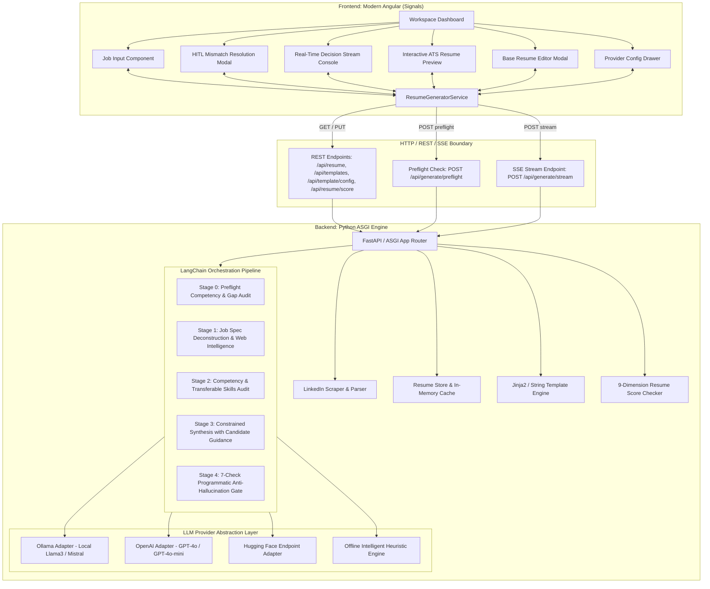

# Technical Architecture Specification: AI-Powered Resume Generator

This document provides the authoritative engineering specification for the **AI-Powered Resume Generator**, designed to meet enterprise standards for modularity, privacy, anti-hallucination compliance, and high-performance real-time streaming.

---

## 1. System Architecture



---

## 2. Component Directory Layout

```
resume-generator/
├── .vscode/
│   ├── launch.json                # VS Code launch & compound debug configurations
│   ├── tasks.json                 # VS Code tasks (run full stack, build, test, docker)
│   ├── settings.json              # Python, Tailwind CSS, and editor configurations
│   └── extensions.json            # Recommended extensions (Python, Angular, Tailwind)
├── docs/
│   ├── ADR.md                     # Architecture Decision Records
│   ├── ARCHITECTURE.md            # System Architecture Specification (this document)
│   └── IMPLEMENTATION_PLAN.md     # Implementation Blueprint & Verification Matrix
├── backend/
│   ├── app/
│   │   ├── __init__.py
│   │   ├── main.py                # ASGI application entrypoint & routing
│   │   ├── models/
│   │   │   ├── __init__.py
│   │   │   └── resume.py          # Pydantic schemas: Resume, JobInput, StreamEvents
│   │   └── services/
│   │       ├── __init__.py
│   │       ├── linkedin_extractor.py # Web scraper & structured job extractor
│   │       ├── resume_store.py       # Base resume loader & persistent manager
│   │       ├── template_engine.py    # Predefined ATS HTML templates & print styles
│   │       └── generator_chain.py    # LangChain multi-stage reasoning & anti-hallucination guard
│   ├── data/
│   │   ├── sample_resume.json        # Generic anonymized sample resume (shipped with package)
│   │   └── default_base_resume.json  # Initialized base resume for local user
│   ├── tests/
│   │   ├── __init__.py
│   │   ├── test_backend.py           # Unit tests (models, templates, anti-hallucination)
│   │   └── test_e2e.py               # E2E integration tests (ASGI routes & SSE streams)
│   ├── requirements.txt
│   └── run.py
├── frontend/
│   ├── src/
│   │   ├── app/
│   │   │   ├── models/
│   │   │   │   └── resume.models.ts  # TypeScript schemas
│   │   │   ├── services/
│   │   │   │   └── resume-generator.service.ts # Signals state store & SSE reader
│   │   │   ├── shared/components/    # Reusable UI primitives
│   │   │   │   ├── badge/            # BadgeComponent (.ts, .html, .scss)
│   │   │   │   ├── card/             # CardComponent (.ts, .html, .scss)
│   │   │   │   └── modal/            # ModalComponent (.ts, .html, .scss)
│   │   │   ├── components/           # Feature components (.ts, .html, .scss)
│   │   │   │   ├── header/
│   │   │   │   ├── job-input/
│   │   │   │   ├── stream-console/
│   │   │   │   ├── resume-preview/
│   │   │   │   ├── base-resume-modal/
│   │   │   │   └── settings-drawer/
│   │   │   ├── app.ts, app.html, app.scss
│   │   ├── index.html
│   │   ├── main.ts
│   │   └── styles.scss               # Tailwind CSS directives & global styling
│   ├── tailwind.config.js
│   ├── postcss.config.js
│   ├── package.json
│   └── angular.json
├── Dockerfile                     # Multi-stage container build
├── docker-compose.yml             # Single-command environment spin-up
├── start.sh                       # Local development startup script
├── .gitignore                     # Prevents personal PII leakage
└── README.md                      # Open-source package documentation
```

---

## 3. Data Invariant: The Ground Truth Principle

### Anti-Hallucination Invariant
The candidate's Base Resume is the single source of truth. The system guarantees that:
1. **Employment History Invariance**: Company names, dates of employment, and job titles cannot be created out of thin air.
2. **Education Invariance**: Degrees, institutions, and graduation years cannot be modified or fabricated.
3. **Timeline Invariance**: Employment periods cannot be extended, shortened, or fabricated.
4. **Identity Invariance**: Contact information (Name, Email, Phone, LinkedIn, GitHub, Portfolio) is preserved verbatim and normalized to absolute URLs.
5. **Project & Certification Invariance**: Architectural case studies and certifications must originate strictly from candidate ground truth.
6. **Strict Skills Non-Fabrication Gate (Check 7)**: Every skill presented in the final resume must be grounded in the candidate's verified ground truth corpus (`skills`, `experience`, `projects`, `certifications`, `raw_text`, `summary`). Any ungrounded skill (e.g. FreeRTOS, Swift, Go, Kubernetes if not in source) is automatically purged.
7. **Achievement Framing**: Bullet points must rephrase or contextualize *actual achievements* from the candidate's history rather than inventing fictional projects or responsibilities.

### Programmatic Verification Stage (7 Deterministic Checks)
Before any generated resume payload is sent to the client, `_verify_anti_hallucination()` executes:
```python
def _verify_anti_hallucination(self, base_resume: ResumeData, generated: ResumeData) -> VerificationResult:
    # Check 1: Verify companies
    base_companies = {exp.company.lower().strip() for exp in base_resume.experience}
    gen_companies = {exp.company.lower().strip() for exp in generated.experience}
    rogue_companies = gen_companies - base_companies
    if rogue_companies:
        raise AntiHallucinationViolation(f"Unauthorized companies detected: {rogue_companies}")
    
    # Check 2: Verify education & institutions
    base_schools = {edu.institution.lower().strip() for edu in base_resume.education}
    gen_schools = {edu.institution.lower().strip() for edu in generated.education}
    rogue_schools = gen_schools - base_schools
    if rogue_schools:
        raise AntiHallucinationViolation(f"Unauthorized education institutions detected: {rogue_schools}")

    # Check 3: Verify employment timelines
    base_periods = {exp.period.strip() for exp in base_resume.experience}
    gen_periods = {exp.period.strip() for exp in generated.experience}
    rogue_periods = gen_periods - base_periods
    if rogue_periods:
        raise AntiHallucinationViolation(f"Unauthorized employment periods detected: {rogue_periods}")

    # Check 4: Verify personal identity
    if generated.name.strip().lower() != base_resume.name.strip().lower():
        raise AntiHallucinationViolation("Candidate identity mismatch")

    # Check 5: Verify project names
    base_proj_names = {p.name.lower().strip() for p in (base_resume.projects or [])}
    for p in (generated.projects or []):
        if p.name.lower().strip() not in base_proj_names:
            generated.projects = [proj for proj in generated.projects if proj.name.lower().strip() in base_proj_names]

    # Check 6: Verify certification credentials
    base_cert_names = {c.name.lower().strip() for c in (base_resume.certifications or [])}
    for c in (generated.certifications or []):
        if c.name.lower().strip() not in base_cert_names:
            generated.certifications = [cert for cert in generated.certifications if cert.name.lower().strip() in base_cert_names]

    # Check 7: Strict Skills Non-Fabrication Gate
    # Purge any skill not grounded in candidate ground-truth corpus
    corpus = self._extract_full_candidate_corpus(base_resume)
    for category, skill_list in list(generated.skills.items()):
        verified_skills = [
            skill for skill in skill_list
            if self._is_skill_grounded(skill, corpus, base_resume)
        ]
        generated.skills[category] = verified_skills
    
    return VerificationResult(status="PASSED", rogue_entities=[])
```

---

## 4. HTTP API & Streaming Protocol

### HTTP REST Endpoints
| Method | Path | Request Body | Response | Description |
|---|---|---|---|---|
| `POST` | `/api/generate/preflight` | `JobInput` | `PreflightReport` | Fast preflight audit detecting role/competency gaps & triggering HITL dialog |
| `POST` | `/api/generate/stream` | `JobInput` | `text/event-stream` | Real-time SSE decision streaming & tailored resume synthesis |
| `GET` | `/api/resume/base` | None | `ResumeData` | Retrieves candidate Ground Truth profile |
| `PUT` | `/api/resume/base` | `ResumeData` | `{"status": "ok"}` | Persists updated Ground Truth profile |
| `POST` | `/api/resume/upload` | `{"file_content": str, "filename": str}` | `ResumeData` | Ingests PDF/DOCX/TXT/JSON into Ground Truth profile |
| `GET` | `/api/resume/score` | None | `ScoreCard` | Audits candidate ground truth against 9-dimension rubric |
| `POST` | `/api/resume/score` | `{"resume": ResumeData, "target_role": str}` | `ScoreCard` | Audits tailored resume against specific role |
| `GET` | `/api/template/config` | None | `TemplateConfig` | Retrieves saved visual styling & design tokens |
| `PUT` | `/api/template/config` | `TemplateConfig` | `{"status": "ok"}` | Updates and persists custom styling preferences |
| `POST` | `/api/template/config/reset` | None | `TemplateConfig` | Resets styling preferences to default |
| `POST` | `/api/render` | `{"resume": ResumeData, "template_id": str}` | `{"html": str}` | Renders printable ATS HTML with injected design tokens |
| `GET` | `/api/evals/cases` | None | `List[EvalCaseSummary]` | Lists all 6 evaluation benchmark cases |
| `POST` | `/api/evals/run` | `{"case_id": Optional[str], "provider": str}` | `EvalSuiteReport` | Executes benchmark evaluation and audits all 5 checkpoints |
| `GET` | `/api/evals/latest` | None | `EvalSuiteReport` | Retrieves latest cached evaluation benchmark report |

### Streaming Protocol (Server-Sent Events)
Streaming endpoint: `POST /api/generate/stream`  
Content-Type: `text/event-stream; charset=utf-8`

### Event Taxonomy
| Event Type | Payload Schema | Description |
|---|---|---|
| `step` | `{"step": "analysis|audit|synthesis|verification", "title": str, "status": "running|done"}` | Progress stepper milestone transition |
| `thought` | `{"step": str, "content": str, "timestamp": str}` | Fine-grained internal reasoning token/chunk |
| `audit` | `{"match_score": int, "direct_matches": list, "transferable": list, "unmatched_skills": list, "is_low_match": bool}` | Alignment audit and competency matrix |
| `resume_chunk` | `{"section": str, "data": dict}` | Incremental preview update |
| `complete` | `{"resume": ResumeData, "html": str, "audit": AlignmentReport}` | Final synthesized resume and pre-rendered HTML |
| `error` | `{"message": str, "code": str}` | Structured error notification |

---

## 5. Predefined ATS HTML Resume Templates

The template engine provides three distinct layout philosophies:
1. **Modern Tech**:
   - Clean sans-serif typography (system-ui / Inter).
   - Subtle accent color highlights on section headers.
   - Skill badges with direct job match visual emphasis.
   - 2-column contact header with social links (LinkedIn, GitHub).
2. **Executive Minimalist**:
   - High-contrast, classic styling with crisp horizontal rules.
   - High whitespace, conservative margin layout.
   - Maximum compatibility with legacy ATS parsers.
3. **Compact Classic**:
   - High-density single-page format for senior engineering profiles.
   - Horizontal inline competency tags.

### Print & PDF Export Architecture
All templates embed strict `@media print` rules:
```css
@media print {
  body {
    background: #ffffff !important;
    margin: 0 !important;
    padding: 0 !important;
    font-size: 10.5pt;
    color: #000000;
  }
  .no-print, .interactive-controls {
    display: none !important;
  }
  .experience-item, .education-item {
    break-inside: avoid;
    page-break-inside: avoid;
  }
  @page {
    margin: 1.2cm 1.5cm;
    size: letter portrait;
  }
}
```
This guarantees that invoking `window.print()` outputs a pristine, vector-sharp PDF document without URL headers, page numbers, or unwanted blank pages.

---

## 6. Distributability & Packaging

The package is engineered to be distributed freely as an open-source tool:
- **No Personal PII in Git**: The default repository contains `sample_resume.json` (fictional senior engineer).
- **User Specific Resume Loading**: The user can upload their resume in the UI or set `RESUME_DATA_PATH=my_resume.json`.
- **Zero-Dependency Startup**: Includes an offline heuristic generation mode so users can immediately test the pipeline without configuring API keys.
- **Docker Ready**: Fully bundled multi-stage Docker build ready for immediate containerized deployment.
