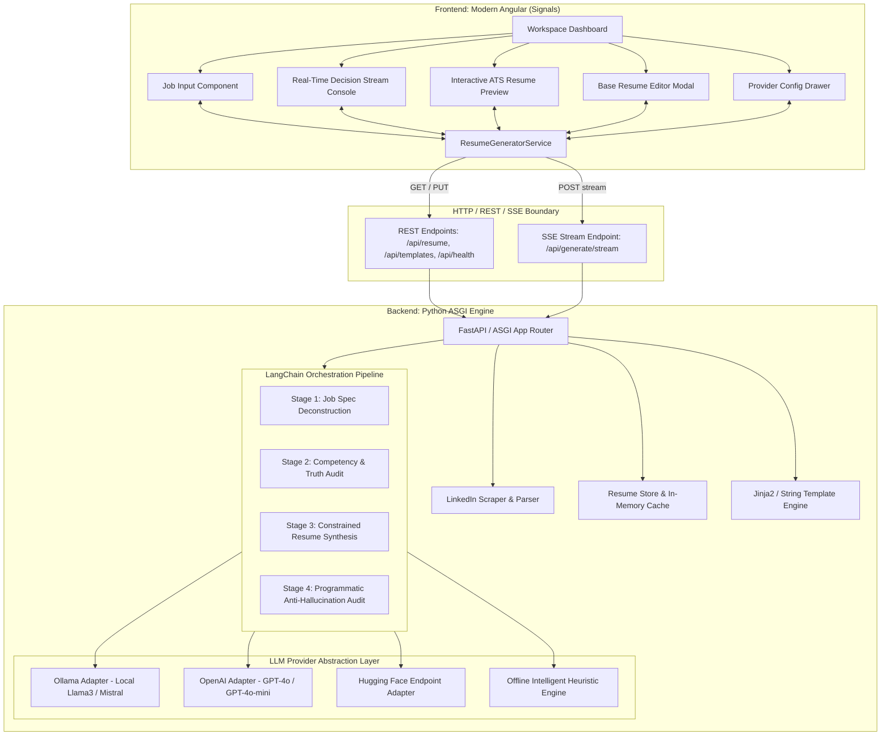

# Technical Architecture Specification: AI-Powered Resume Generator

This document provides the authoritative engineering specification for the **AI-Powered Resume Generator**, designed to meet enterprise standards for modularity, privacy, anti-hallucination compliance, and high-performance real-time streaming.

---

## 1. System Architecture



---

## 2. Component Directory Layout

```
resume-generator/
├── .vscode/
│   ├── launch.json                # VS Code launch & compound debug configurations
│   ├── tasks.json                 # VS Code tasks (run full stack, build, test, docker)
│   ├── settings.json              # Python, Tailwind CSS, and editor configurations
│   └── extensions.json            # Recommended extensions (Python, Angular, Tailwind)
├── docs/
│   ├── ADR.md                     # Architecture Decision Records
│   ├── ARCHITECTURE.md            # System Architecture Specification (this document)
│   └── IMPLEMENTATION_PLAN.md     # Implementation Blueprint & Verification Matrix
├── backend/
│   ├── app/
│   │   ├── __init__.py
│   │   ├── main.py                # ASGI application entrypoint & routing
│   │   ├── models/
│   │   │   ├── __init__.py
│   │   │   └── resume.py          # Pydantic schemas: Resume, JobInput, StreamEvents
│   │   └── services/
│   │       ├── __init__.py
│   │       ├── linkedin_extractor.py # Web scraper & structured job extractor
│   │       ├── resume_store.py       # Base resume loader & persistent manager
│   │       ├── template_engine.py    # Predefined ATS HTML templates & print styles
│   │       └── generator_chain.py    # LangChain multi-stage reasoning & anti-hallucination guard
│   ├── data/
│   │   ├── sample_resume.json        # Generic anonymized sample resume (shipped with package)
│   │   └── default_base_resume.json  # Initialized base resume for local user
│   ├── tests/
│   │   ├── __init__.py
│   │   ├── test_backend.py           # Unit tests (models, templates, anti-hallucination)
│   │   └── test_e2e.py               # E2E integration tests (ASGI routes & SSE streams)
│   ├── requirements.txt
│   └── run.py
├── frontend/
│   ├── src/
│   │   ├── app/
│   │   │   ├── models/
│   │   │   │   └── resume.models.ts  # TypeScript schemas
│   │   │   ├── services/
│   │   │   │   └── resume-generator.service.ts # Signals state store & SSE reader
│   │   │   ├── shared/components/    # Reusable UI primitives
│   │   │   │   ├── badge/            # BadgeComponent (.ts, .html, .scss)
│   │   │   │   ├── card/             # CardComponent (.ts, .html, .scss)
│   │   │   │   └── modal/            # ModalComponent (.ts, .html, .scss)
│   │   │   ├── components/           # Feature components (.ts, .html, .scss)
│   │   │   │   ├── header/
│   │   │   │   ├── job-input/
│   │   │   │   ├── stream-console/
│   │   │   │   ├── resume-preview/
│   │   │   │   ├── base-resume-modal/
│   │   │   │   └── settings-drawer/
│   │   │   ├── app.ts, app.html, app.scss
│   │   ├── index.html
│   │   ├── main.ts
│   │   └── styles.scss               # Tailwind CSS directives & global styling
│   ├── tailwind.config.js
│   ├── postcss.config.js
│   ├── package.json
│   └── angular.json
├── Dockerfile                     # Multi-stage container build
├── docker-compose.yml             # Single-command environment spin-up
├── start.sh                       # Local development startup script
├── .gitignore                     # Prevents personal PII leakage
└── README.md                      # Open-source package documentation
```

---

## 3. Data Invariant: The Ground Truth Principle

### Anti-Hallucination Invariant
The candidate's Base Resume is the single source of truth. The system guarantees that:
1. **Employment History Invariance**: Company names, dates of employment, and job titles cannot be created out of thin air.
2. **Education Invariance**: Degrees, institutions, and graduation years cannot be modified or fabricated.
3. **Skill Grounding**: Every highlighted or prioritized skill must either exist in the Base Resume or be an explicitly verified synonym/transferable capability.
4. **Achievement Framing**: Bullet points must rephrase or contextualize *actual achievements* from the candidate's history rather than inventing fictional projects or responsibilities.

### Programmatic Verification Stage
Before any generated resume payload is sent to the client:
```python
def verify_anti_hallucination(base_resume: ResumeData, generated: ResumeData) -> VerificationResult:
    # 1. Verify companies
    base_companies = {exp.company.lower().strip() for exp in base_resume.experience}
    gen_companies = {exp.company.lower().strip() for exp in generated.experience}
    rogue_companies = gen_companies - base_companies
    if rogue_companies:
        raise AntiHallucinationViolation(f"Unauthorized companies detected: {rogue_companies}")
    
    # 2. Verify education
    base_schools = {edu.institution.lower().strip() for edu in base_resume.education}
    gen_schools = {edu.institution.lower().strip() for edu in generated.education}
    rogue_schools = gen_schools - base_schools
    if rogue_schools:
        raise AntiHallucinationViolation(f"Unauthorized education institutions detected: {rogue_schools}")
    
    return VerificationResult(status="PASSED", rogue_entities=[])
```

---

## 4. Streaming Protocol (Server-Sent Events)

Streaming endpoint: `POST /api/generate/stream`  
Content-Type: `text/event-stream; charset=utf-8`

### Event Taxonomy
| Event Type | Payload Schema | Description |
|---|---|---|
| `step` | `{"step": "analysis|audit|synthesis|verification", "title": str, "status": "running|done"}` | Progress stepper milestone transition |
| `thought` | `{"step": str, "content": str, "timestamp": str}` | Fine-grained internal reasoning token/chunk |
| `audit` | `{"match_score": int, "direct_matches": list, "transferable": list, "gaps": list}` | Alignment audit and competency matrix |
| `resume_chunk` | `{"section": str, "data": dict}` | Incremental preview update |
| `complete` | `{"resume": ResumeData, "html": str, "audit": AlignmentReport}` | Final synthesized resume and pre-rendered HTML |
| `error` | `{"message": str, "code": str}` | Structured error notification |

---

## 5. Predefined ATS HTML Resume Templates

The template engine provides three distinct layout philosophies:
1. **Modern Tech**:
   - Clean sans-serif typography (system-ui / Inter).
   - Subtle accent color highlights on section headers.
   - Skill badges with direct job match visual emphasis.
   - 2-column contact header with social links (LinkedIn, GitHub).
2. **Executive Minimalist**:
   - High-contrast, classic styling with crisp horizontal rules.
   - High whitespace, conservative margin layout.
   - Maximum compatibility with legacy ATS parsers.
3. **Compact Classic**:
   - High-density single-page format for senior engineering profiles.
   - Horizontal inline competency tags.

### Print & PDF Export Architecture
All templates embed strict `@media print` rules:
```css
@media print {
  body {
    background: #ffffff !important;
    margin: 0 !important;
    padding: 0 !important;
    font-size: 10.5pt;
    color: #000000;
  }
  .no-print, .interactive-controls {
    display: none !important;
  }
  .experience-item, .education-item {
    break-inside: avoid;
    page-break-inside: avoid;
  }
  @page {
    margin: 1.2cm 1.5cm;
    size: letter portrait;
  }
}
```
This guarantees that invoking `window.print()` outputs a pristine, vector-sharp PDF document without URL headers, page numbers, or unwanted blank pages.

---

## 6. Distributability & Packaging

The package is engineered to be distributed freely as an open-source tool:
- **No Personal PII in Git**: The default repository contains `sample_resume.json` (fictional senior engineer).
- **User Specific Resume Loading**: The user can upload their resume in the UI or set `RESUME_DATA_PATH=my_resume.json`.
- **Zero-Dependency Startup**: Includes an offline heuristic generation mode so users can immediately test the pipeline without configuring API keys.
- **Docker Ready**: Fully bundled multi-stage Docker build ready for immediate containerized deployment.
